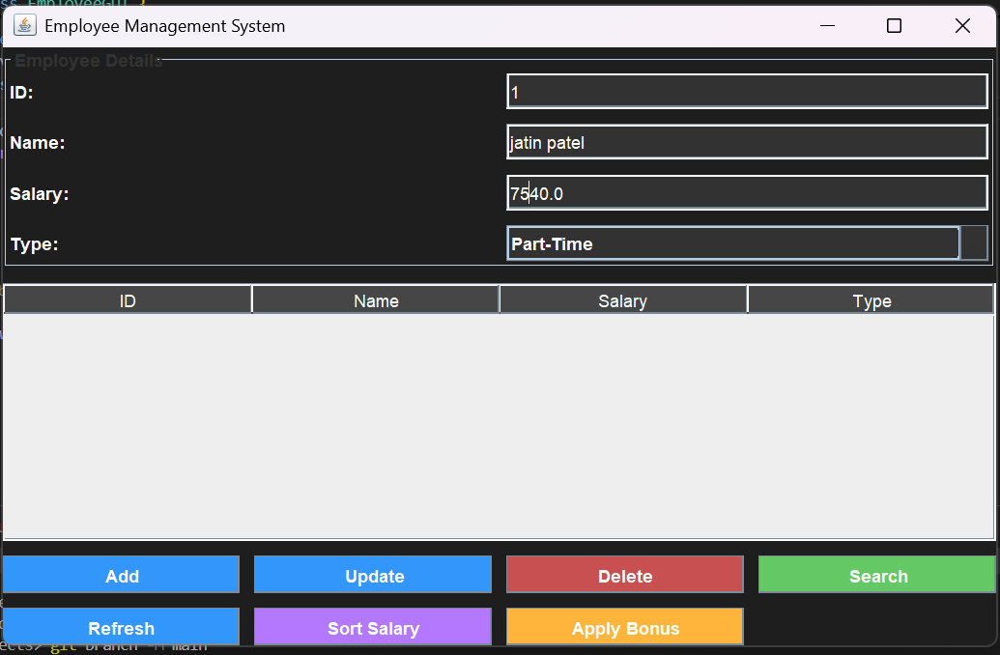
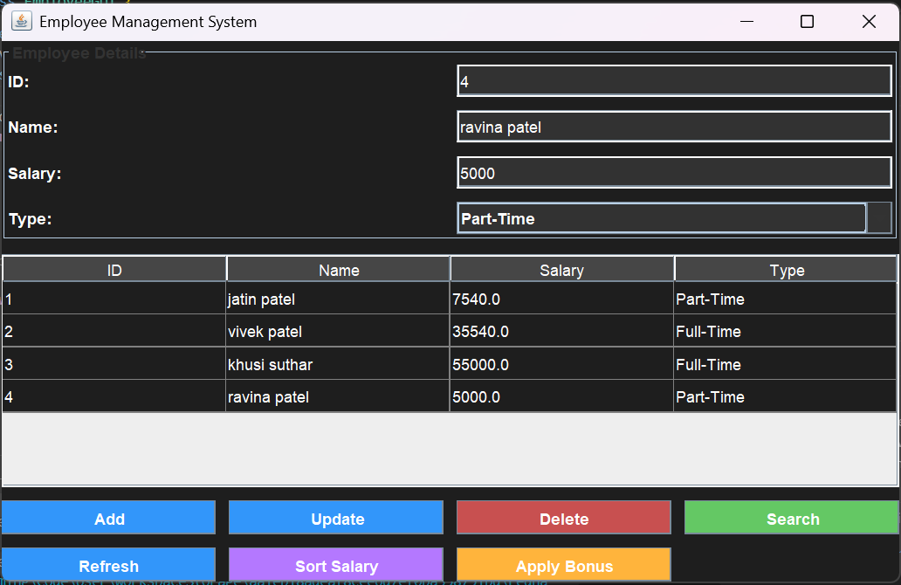
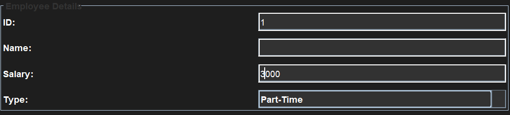
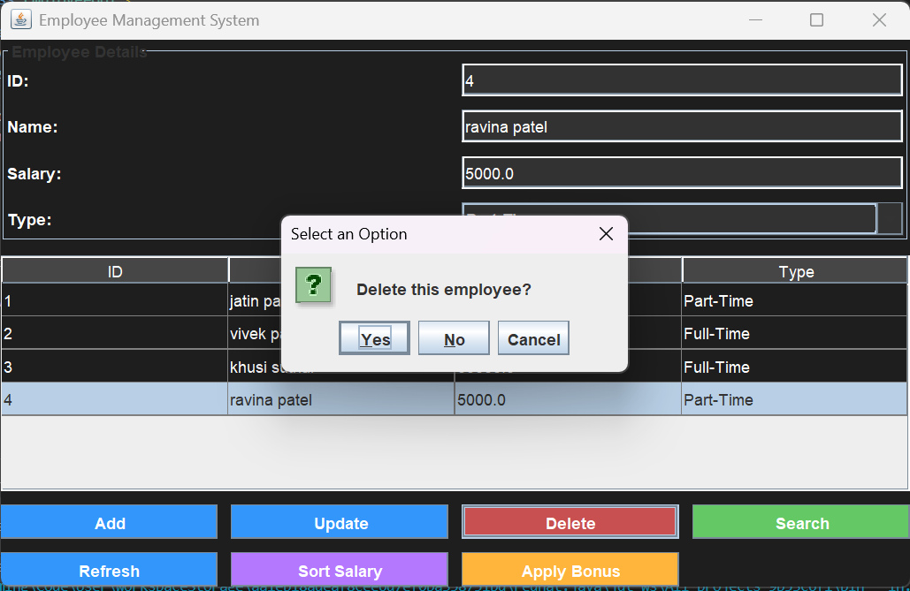
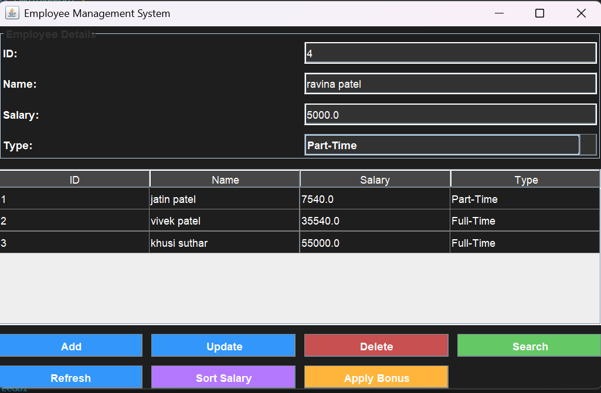
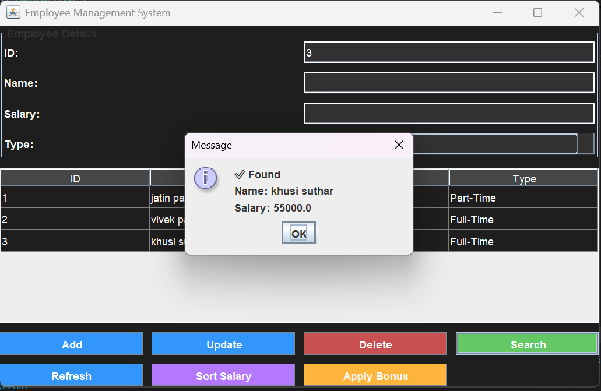
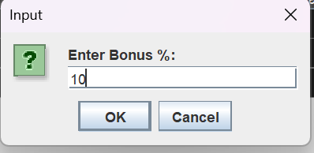
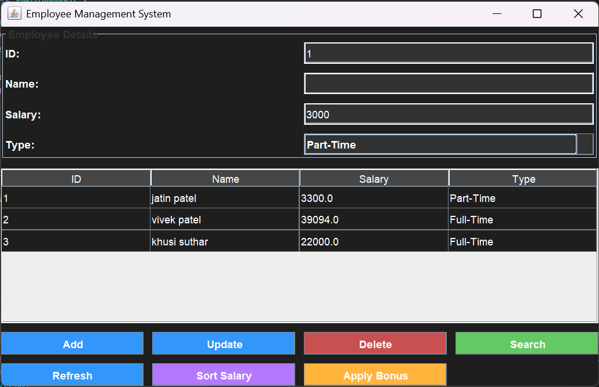

# 💼 Employee Management System (Java Mini Project)

  

  <b>📘 Programming with Java Mini Project</b> 
  <i>Complete GUI-Based Employee Management System</i>

  
  
  

---

## 👨‍🎓 Student Details

| Field | Details |
|------|--------|
| 👤 Name of member1 | Om Machhi (12502080603013) |
| 👤 Name of member2 | Yashsvi Sanash (12502080603021) |
| 🎓 Course | Java Programming |
| 📅 Academic Year | 2025-26 |

---

# 📑 Project Overview

This project is a **GUI-based Employee Management System** that allows users to:

✨ Manage employee records  
✨ Perform CRUD operations  
✨ Apply bonus and sorting  
✨ Store data using file handling  
✨ Use threading for updates  

---

# 🧩 Core Functional Modules

---

## 🔹 Module 1: Add Employee
📌 Add new employee with ID, Name, Salary, Type  

  

---

## 🔹 Module 2: Employee Added Output
📌 Data successfully inserted and displayed in table  

  

---

## 🔹 Module 3: Update Employee
📌 Update salary using threading  

  

---

## 🔹 Module 4: Updated Employee Output
📌 Updated salary reflected in system  

  

---

## 🔹 Module 5: Delete Employee
📌 Delete employee using ID  

  

---

## 🔹 Module 6: Deleted Output
📌 Record removed successfully  

  

---

## 🔹 Module 7: Search Employee
📌 Search employee by ID  

  

---

## 🔹 Module 8: Apply Bonus
📌 Enter bonus percentage  

  

---

## 🔹 Module 9: Bonus Applied Output
📌 Salary updated for all employees  

  

---

# ⚙️ Technologies Used

- Java (Core)
- Java Swing (GUI)
- Collections (HashMap, HashSet)
- File Handling (Text File)
- Multithreading

---

# 🧠 Concepts Implemented

✔ Inheritance & Polymorphism  
✔ Inner Class (Payroll)  
✔ Exception Handling  
✔ Threading  
✔ Collection Framework  
✔ File Handling  

---

# 📂 Data Storage
in/ac/adit/pwj/miniproject/employees/
├── Employee.java
├── FullTimeEmployee.java
├── PartTimeEmployee.java
├── EmployeeManager.java
├── EmployeeGUI.java
